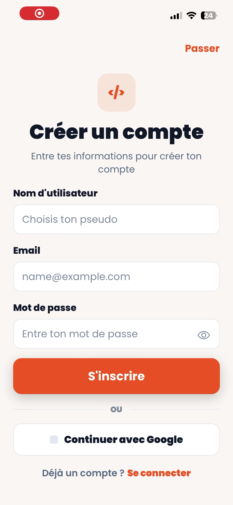
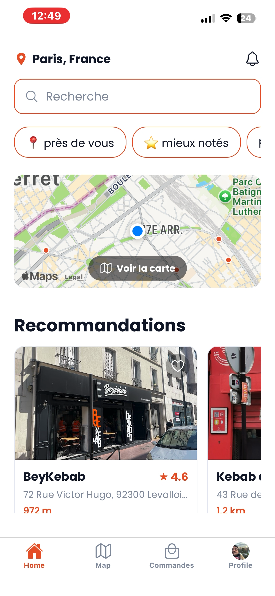
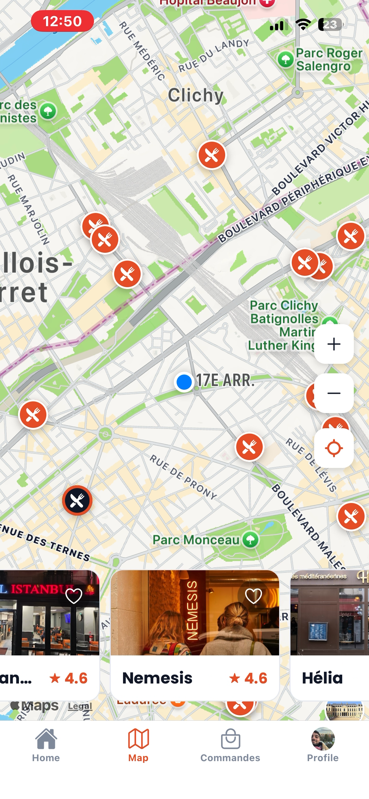
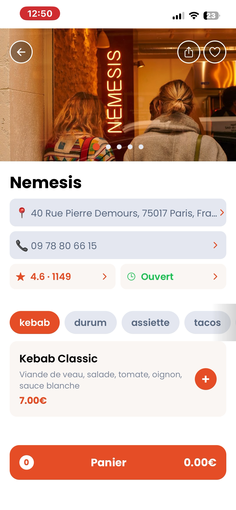

# 🥙 Keb'App — Frontend

Application mobile de découverte et de commande de restaurants kebab avec géolocalisation.

## Présentation

Keb'App permet de trouver des restaurants kebab autour de soi, consulter leurs menus, composer sa commande et payer directement depuis l'application. L'interface est conçue pour une expérience fluide et intuitive sur mobile.

**Projet final** réalisé en équipe de 3 lors de la formation La Capsule (certification RNCP Niveau 6 — Concepteur Développeur d'Applications Web & Mobile).

### Mes contributions

- Écrans d'authentification (inscription / connexion)
- Écran de détail restaurant (fiche resto)
- Modal panier avec gestion des options
- Écran de paiement
- Écran d'historique des commandes

## Fonctionnalités

- **Géolocalisation** — Affichage des restaurants à proximité sur une carte interactive
- **Authentification** — Inscription et connexion sécurisées
- **Fiche restaurant** — Menu détaillé avec personnalisation des options
- **Panier** — Ajout, modification et suppression d'articles avec gestion des options
- **Paiement** — Processus de commande complet
- **Historique** — Consultation des commandes passées
- **Profil utilisateur** — Gestion du compte

## Stack technique

- **React Native** avec **Expo**
- **Redux** pour la gestion d'état globale
- **React Navigation** (Stack + Bottom Tabs)
- **Google Maps API** pour la géolocalisation et l'affichage carte
- Police **Poppins** (5 weights : 400, 600, 700, 800, 900)

## Installation

```bash
git clone https://github.com/sofianetirecht/Kebapp-frontend.git
cd kebapp-frontend
yarn install
npx expo start
```

> Le backend doit être lancé séparément. Voir le repo [Keb'App Backend](https://github.com/sofianetirecht/Kebapp-Backend.git).

## Screens

L'application comporte 13 écrans :

Onboarding · Géolocalisation · Login · Sign Up · Home · Map · Liste restaurants · Fiche restaurant · Personnalisation menu · Panier · Paiement · Historique · Profil

## Charte graphique

| Élément | Valeur |
|---------|--------|
| Orange principal | `#E8572A` |
| Fond crème | `#FBF7F4` |
| Texte sombre | `#1A1A2E` |
| Police | Poppins |

## Screenshots






## Auteur

**Sofiane Tirecht** — Développeur Web & Mobile Fullstack
